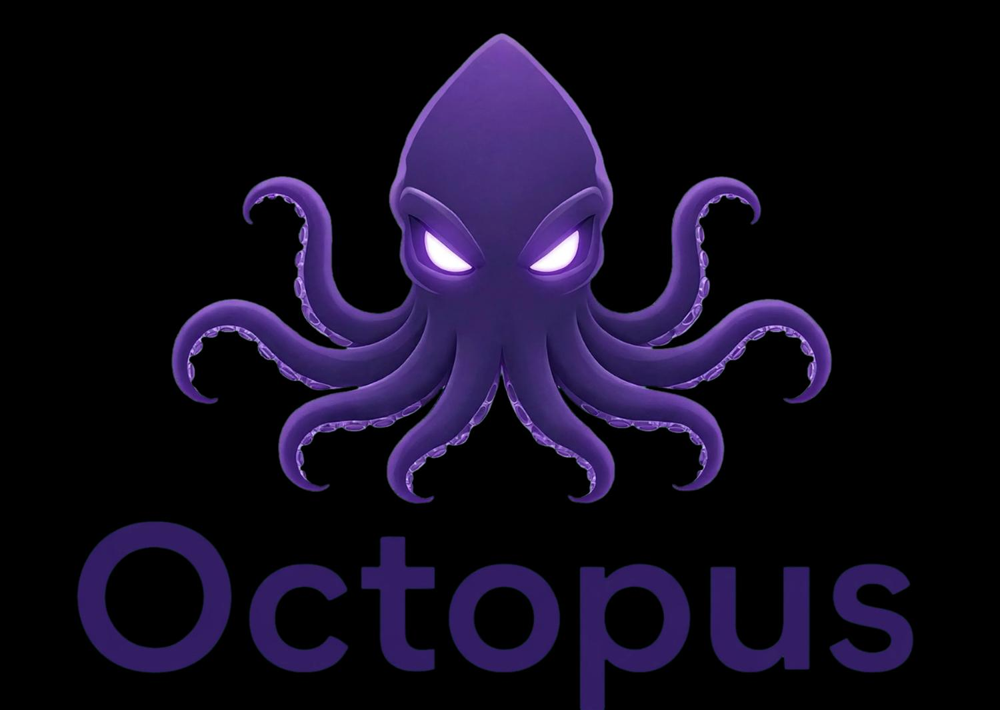

# Octopus

**Browser Cerdas. Hasil Cepat.**

Prototype UI untuk aplikasi browser Octopus.



## Preview

Buka `index.html` di browser untuk melihat tampilan:

- **Beranda** — Logo resmi, search bar, tab (Web/Gambar/Video/Berita/Populer), kartu cuaca
- **Alat (Menu)** — VPN, Tab pribadi, Pemblokir iklan, Riwayat, Unduhan, Favorit, Mode gelap, Hemat data, dll.

## File

| File | Keterangan |
|------|------------|
| `index.html` | Tampilan utama (mobile-first) |
| `logo.png` | Logo utama & logo APK |
| `mascot.png` | Versi crop untuk mascot di menu |

## Cara menjalankan

Cukup buka file `index.html` di browser modern.

```bash
npx serve .
```

## Tech

- Pure HTML + CSS + minimal JavaScript
- Responsive mobile-first (max-width 420px)
- Bahasa Indonesia

---

Dibuat untuk `v1-byte`
